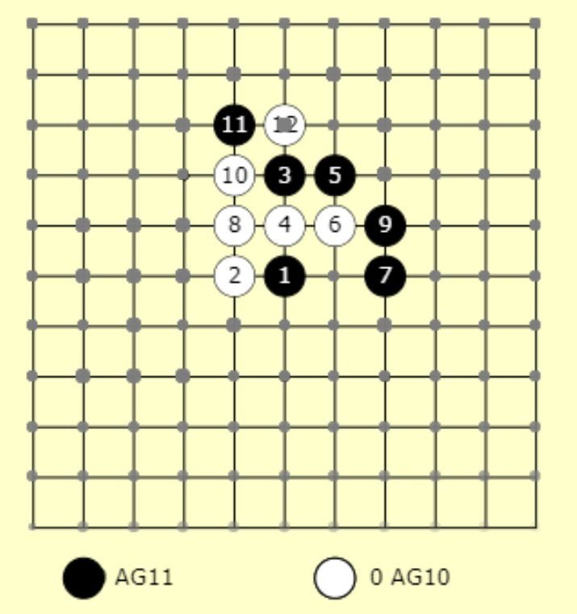

# Gomoku game with DQN and Monte Carlo Tree Search (MCTS)
Gomoku game written in tensorflow, trained with Cnn and using MCTS rollout to play. MCTS part needs more debugging and is better turned off. You can get a reasonably strong AI player (<15x15 board) with just deep neural netowrk prediction.

## Requirement
The model is trained on single Nvidia 1080 GTX, with tensorflow 1.0 and python 3. Pyhton packages required:
    - numpy
    - flask
    - tensorflow

## Basic Usage:
* Training models with default parameters. The script repeatedly searches for the latest (greatest?) model under saved_models and randomly selects an opponent model for training.
```
    $ ./train.py
```
* AI using MCTS against human opponent using a pretrained model.
```
    $ ./gomoku.py --agent1 montecarlo --agent2 web --agent1_model G79 --boardsize 15 --web
```
The example uses pretrained model G79. Use http://<ip address>:5000 to connect to the game engine.
* Play using pretrained model without MCTS search.
```
    $ ./gomoku.py --agent1 web --agent2 dqntest --agent2_model G79 --boardsize 15 --web
```
* Two AIs against each other
```
    $ ./gomoku.py --agent1 montecarlo --agent2 montecarlo --agent1_model G78 --agent2_model G79 --boardsize 15 --web
```

* Two AI players and AI visualization
```
    $ ./gomoku.py --agent1 montecarlo --agent2 montecarlo --agent1_model G78 --agent2_model G79 --boardsize 15 --web --display_AI
```
<a href="http://www.youtube.com/watch?feature=player_embedded&v=GONyVL6TUm4" target="_blank"></a>
